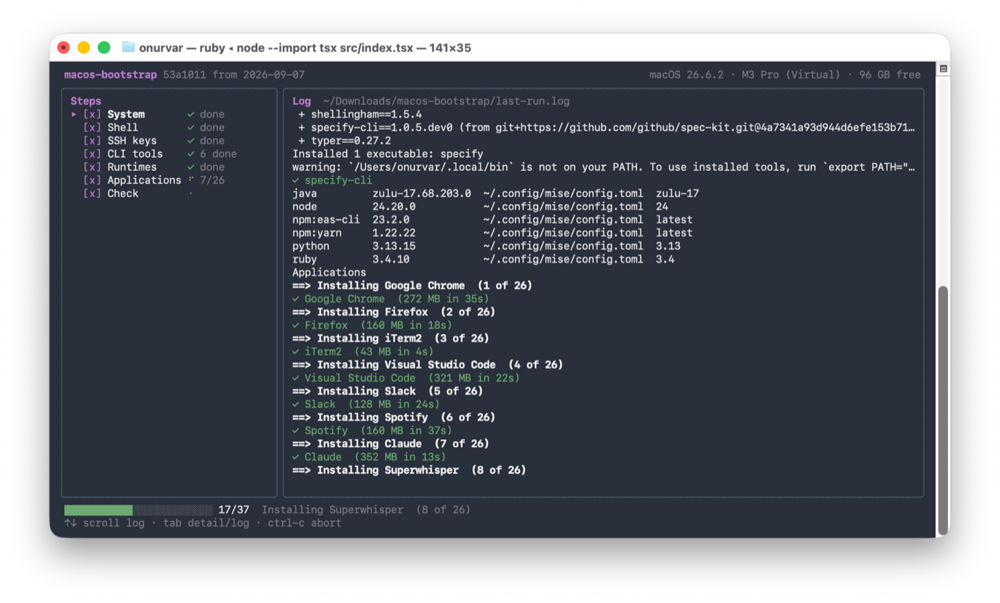

# macos-bootstrap

Sets up a fresh Mac from one command. A terminal app asks what you want and installs it.
The folder it runs from is disposable.

## Run

```sh
/bin/zsh -c "$(curl -fsSL https://raw.githubusercontent.com/OnurVar/macos-bootstrap/main/bootstrap.sh)"
```

Installs the Xcode Command Line Tools and Homebrew, downloads this repo to
`~/Downloads/macos-bootstrap`, and opens the app. You click through one dialog and type your
password once.

Add `--dry-run` to preview without changing anything, or `--yes` to run everything unattended
with no app.

## The app



`↑↓` move · `space` tick · `→←` item list · `a` all or none · `tab` detail or log ·
`d` dry run · `enter` start · `ctrl-c` stop and quit · `q` quit

Everything starts ticked, so enter installs the lot. Anything already installed is skipped.

Before the first step the app asks for the SSH key email, a passphrase (twice), and your
password for `sudo`. Nothing underneath prompts again, and each answer only reaches the step
that asked for it. On quitting it prints the summary, the public keys to add to GitHub and
GitLab, and the path of `last-run.log`.

## Steps

| Step | What it does |
|---|---|
| System | `~/Projects`, `~/Storage`, Finder shows file extensions |
| Shell | Copies `config/zshrc` to `~/.zshrc`, old one kept as a backup. Machine-only lines go in `~/.zshrc.local` |
| SSH keys | ed25519 keys for GitHub and GitLab, `~/.ssh/config` entries, Keychain |
| CLI tools | The `brew` lines of the Brewfile |
| Runtimes | Node, Ruby, Python, Java, yarn and eas-cli via mise, then cocoapods and specify |
| Applications | The `cask` lines of the Brewfile |
| Check | Opens a clean new terminal and reports what it finds |

Every step is safe to rerun, and one failing item never stops the rest. Run the one-liner again
to add something later.

## Check

Runs last, and on its own any time:

```sh
cd ~/Downloads/macos-bootstrap
./install.sh --yes --only verify
```

It checks inside a clean login shell, so it tests what a new terminal actually gets, not what
the installer's own shell had. Something you chose not to install is a yellow note; something
broken is a red failure and exits non-zero.

## Changing things

| What | Where |
|---|---|
| Apps and CLI tools | `Brewfile` — `cask "name"   # Label \| Group` |
| Runtime versions | `config/mise.toml`, under `[tools]` |
| Gems and uv tools | `steps/50-runtimes.sh`, two arrays at the top |
| Shell config | `config/zshrc` |
| Folders created | `steps/10-system.sh` |
| SSH hosts and key names | `steps/30-ssh.sh` |
| A new prompt | `app/src/prompts.ts` |

The Brewfile holds names, not URLs, so Homebrew always fetches the current version. Versions in
`mise.toml` are major only (`ruby = "3.4"`), so patch updates come free.

A new step is a file `steps/NN-name.sh` with a header:

```sh
# label: Applications              shown in the left pane
# desc: Mac apps from Homebrew     one line under the label
# items: cask                      per-item checklist from the Brewfile
# needs: sudo                      what to ask for: email, passphrase, sudo
# does: Install the ticked apps    shown in the detail pane
```

Steps never prompt. They read `BOOTSTRAP_DRY_RUN`, `BOOTSTRAP_SELECT`, `BOOTSTRAP_EMAIL` and
`BOOTSTRAP_PASSPHRASE`, wrap anything that changes the system in `run` so dry run keeps working,
and report `✓ name` and `✗ name`, which the app counts. Helpers are in `lib/common.sh`.

## Without the app

```sh
./install.sh --yes                    # everything
./install.sh --yes --only ssh,apps    # these steps
./install.sh --yes --select slack,gh  # these Brewfile names
./install.sh --yes --dry-run          # preview
./install.sh --list                   # step names
```

## Layout

```
bootstrap.sh    Command Line Tools, Homebrew, download, start the app
app/src/        the app: App.tsx, panes.tsx, runner.ts, steps.ts, brewfile.ts, prompts.ts
steps/          one file per step, silent, driven by the environment
lib/common.sh   run, copy_file, Brewfile parsing, progress, output
Brewfile        apps and CLI tools
config/         zshrc, mise.toml
install.sh      the unattended way
test/run.sh     every check, against a throwaway home
```

The app runs on the Node that mise installs, so nothing extra stays on the Mac.

## Testing

```sh
test/run.sh
```

Syntax, type-check, unit tests, a dry run of every step, a real run of the file-only steps in a
throwaway home, and a full app run. Needs node 22 or newer on PATH.

`--autostart` starts the run with the defaults and `--exit-when-done` quits at the end, so
`--dry-run --autostart --exit-when-done` previews a whole run without touching the keyboard.

For a fresh-macOS rehearsal use a VM (Parallels can download macOS): 4 cores, 8 GB, 100 GB, skip
the Apple ID, snapshot it as `fresh`, run the one-liner, revert and repeat as needed. A VM has no
App Store and no Android emulator.

## Notes

- **SSH keys.** `gh auth login -s admin:public_key && gh ssh-key add ~/.ssh/id_ed25519_github.pub`
- **React Native on iOS.** Xcode build scripts do not load mise. Put
  `export NODE_BINARY="$(/opt/homebrew/bin/mise which node)"` in `.xcode.env.local`.
- **Android.** Android Studio's first-run wizard installs the SDK to `~/Library/Android/sdk`,
  where the shell config already points.
- **idb-companion** needs full Xcode, so install it afterwards:
  `brew install facebook/fb/idb-companion`
- **Coming from nvm, pyenv, rbenv.** `brew uninstall pyenv pyenv-virtualenv rbenv ruby-build`
  and `rm -rf ~/.nvm ~/.pyenv ~/.rbenv`
